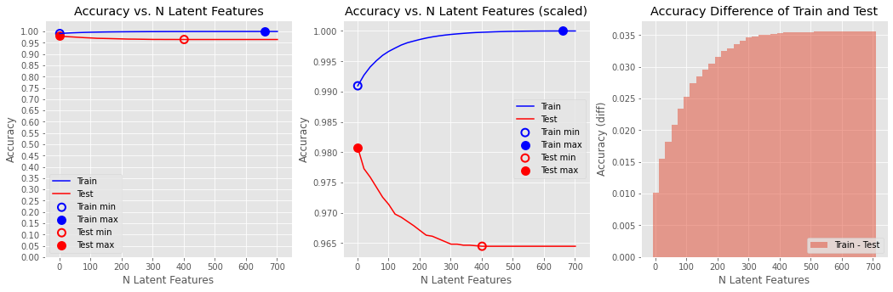

# Recommendations with IBM


## The goal of this project:

Make recommendations for users based on their interests. In order to determine which articles to show to each user, I will perform a study of the data available on the IBM Watson Studio platform. To get a better understanding of their data an account on the platform can be created [here](https://dataplatform.cloud.ibm.com/).


## The datasets:

```python
df.info()
<class 'pandas.core.frame.DataFrame'>
Int64Index: 45993 entries, 0 to 47581
Data columns (total 3 columns):
 #   Column      Non-Null Count  Dtype  
---  ------      --------------  -----  
 0   article_id  45993 non-null  float64
 1   title       45993 non-null  object 
 2   email       45976 non-null  object 
dtypes: float64(1), object(2)
memory usage: 1.4+ MB
```

```python
df_content.info()
<class 'pandas.core.frame.DataFrame'>
Int64Index: 1056 entries, 3 to 3281
Data columns (total 5 columns):
 #   Column           Non-Null Count  Dtype 
---  ------           --------------  ----- 
 0   doc_body         1042 non-null   object
 1   doc_description  1053 non-null   object
 2   doc_full_name    1056 non-null   object
 3   doc_status       1056 non-null   object
 4   article_id       1056 non-null   int64 
dtypes: int64(1), object(4)
memory usage: 49.5+ KB
```

The number of unique articles in the dataset is 1051.
The number of unique users in the dataset is 5148.
The number of user-article interactions in the dataset 45993.
The most viewed article has 937 views.
On average (mean) user has around 9 interactions with all the data.
While median value for user interactions is 3.
This means user interactions data has right skewed distribution.


## Steps to complete:

I. Exploratory Data Analysis

Before making recommendations of any kind, you will need to explore the data you are working with for the project. Dive in to see what you can find. There are some basic, required questions to be answered about the data you are working with throughout the rest of the notebook. Use this space to explore, before you dive into the details of your recommendation system in the later sections.

II. Rank Based Recommendations

To get started in building recommendations, you will first find the most popular articles simply based on the most interactions. Since there are no ratings for any of the articles, it is easy to assume the articles with the most interactions are the most popular. These are then the articles we might recommend to new users (or anyone depending on what we know about them).

III. User-User Based Collaborative Filtering

In order to build better recommendations for the users of IBM's platform, we could look at users that are similar in terms of the items they have interacted with. These items could then be recommended to the similar users. This would be a step in the right direction towards more personal recommendations for the users. You will implement this next.

IV. Content Based Recommendations (EXTRA - NOT REQUIRED)

Given the amount of content available for each article, there are a number of different ways in which someone might choose to implement a content based recommendations system. Using your NLP skills, you might come up with some extremely creative ways to develop a content based recommendation system. You are encouraged to complete a content based recommendation system, but not required to do so to complete this project.

V. Matrix Factorization

Finally, you will complete a machine learning approach to building recommendations. Using the user-item interactions, you will build out a matrix decomposition. Using your decomposition, you will get an idea of how well you can predict new articles an individual might interact with (spoiler alert - it isn't great). You will finally discuss which methods you might use moving forward, and how you might test how well your recommendations are working for engaging users.


## Trained model evaluation:



The lowest accuracy of 99.09% on the train set was achieved with 1 latent features.
The highest accuracy of 100.00% on the train set was achieved with 661 latent features.
The lowest accuracy of 96.45% on the test set was achieved with 401 latent features.
The highest accuracy of 98.07% on the test set was achieved with 1 latent features.


### Requirements

- matplotlib==3.5.0
- numpy==1.21.4
- pandas==1.3.4


### Instructions

1. Open Recommendations_with_IBM.ipynb

2. Run All
